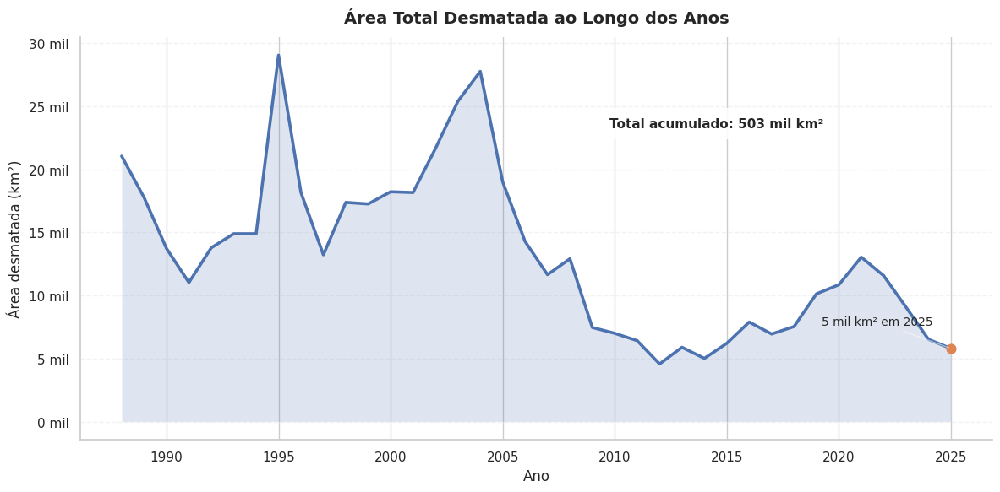
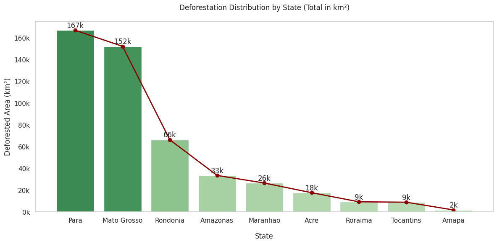
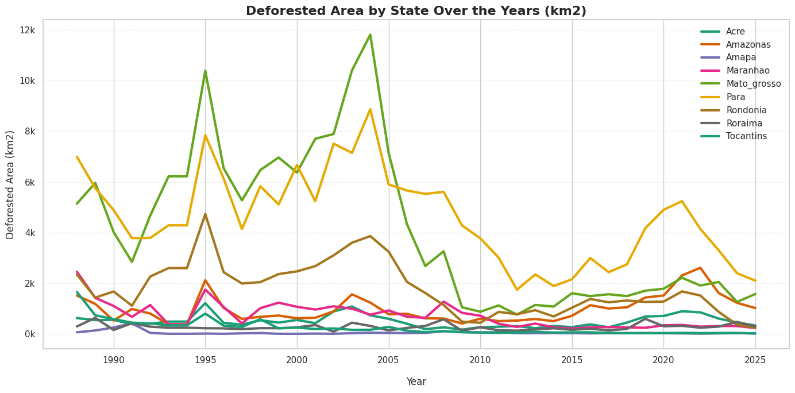
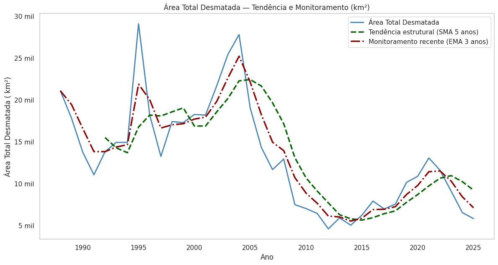

# Desmatamento na Amazônia Legal — Análise Histórica e Regional (PRODES/INPE)

Análise orientada a dados sobre a evolução do desmatamento na Amazônia Legal ao longo de três décadas, com foco na identificação de padrões estruturais, concentração regional e mudanças de tendência relevantes para políticas públicas e tomada de decisão.

## Contexto

A Amazônia Legal concentra o maior bioma tropical do planeta e desempenha papel crítico na regulação climática global. Compreender a dinâmica do desmatamento é essencial para avaliar riscos ambientais, pressões econômicas e a efetividade de políticas de controle.

Este projeto utiliza dados oficiais do PRODES/INPE para construir uma leitura analítica clara da evolução do desmatamento no Brasil.

## Perguntas de Negócio

A análise foi estruturada para responder:

- Como o desmatamento evoluiu ao longo do tempo?
- Existem ciclos ou mudanças estruturais na tendência?
- Quais estados concentram maior impacto ambiental?
- O problema está se agravando ou estabilizando?

## Principais Achados

Entre 1990 e 2025, a Amazônia Legal perdeu aproximadamente **503 mil km² de cobertura florestal**, cerca de 10% da área total da região.

Os dados revelam três fases distintas:

**1. Expansão (anos 1990 — início dos 2000)**  
Crescimento acelerado do desmatamento, culminando no pico histórico de 2004.

**2. Redução Sustentada (2004–2012)**  
Queda consistente nas taxas anuais, indicando forte impacto de políticas de controle.

**3. Retomada Gradual (2012–2020)**  
Reversão parcial da tendência, sugerindo pressões estruturais persistentes.

## Concentração Regional

O desmatamento não ocorre de forma homogênea.

A maior parte está concentrada em poucos estados:

- Pará e Mato Grosso respondem pela maior parcela acumulada  
- Rondônia apresenta impacto significativo adicional  
- Estados como Amapá e Roraima mantêm níveis relativamente baixos  

Essa distribuição evidencia a influência de fatores econômicos regionais, uso do solo e governança ambiental.

## Interpretação Analítica

Os dados sugerem que o desmatamento na Amazônia segue um padrão cíclico, sensível a:

- Políticas ambientais e fiscalização  
- Expansão agropecuária  
- Pressões econômicas sobre a terra  

A redução observada após 2004 demonstra que intervenções institucionais podem alterar significativamente a trajetória do problema. No entanto, a retomada recente indica que tais avanços podem ser reversíveis.

## Implicações

- O desmatamento permanece estruturalmente concentrado em áreas específicas  
- Estratégias direcionadas a estados críticos tendem a ser mais eficazes  
- A volatilidade histórica sugere necessidade de monitoramento contínuo  

## Conclusão

A análise evidencia que o desmatamento na Amazônia não segue uma trajetória linear, mas ciclos de acelamento e contenção influenciados por fatores econômicos e regulatórios.

Embora tenha havido progresso significativo após o pico de 2004, os dados recentes indicam que o problema permanece ativo e sensível a mudanças institucionais.

Este projeto demonstra como análises de dados podem transformar séries históricas complexas em insights acionáveis para compreensão de desafios ambientais de larga escala.

---

**Autor:** Pedro Sousa  
Data Analytics • Business Intelligence • Data Science
