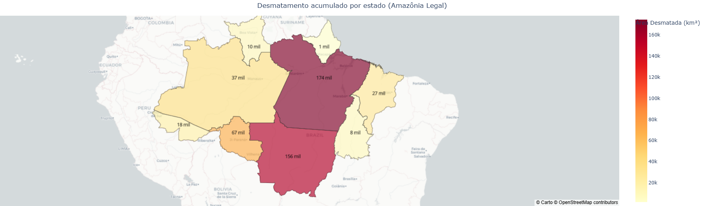

# Desmatamento na Amazônia Legal  
## Análise Histórica e Regional com Dados PRODES/INPE

Análise orientada a dados sobre a evolução do desmatamento na Amazônia Legal ao longo de mais de três décadas.  
O objetivo é transformar uma série histórica extensa em uma leitura quantitativa, estruturada e interpretável.

---

## Base de Dados

- Fonte: PRODES / INPE  
- Periodicidade: Anual  
- Cobertura: Estados da Amazônia Legal  
- Período analisado: 1990–2025  

---

## Escala do Problema

Entre 1990 e 2025, a Amazônia Legal perdeu aproximadamente **503 mil km² de cobertura florestal**.

Esse volume representa cerca de 10% da área total da região, evidenciando a magnitude estrutural do fenômeno.

---

## Dinâmica Temporal

A série histórica revela três fases distintas:

### 1. Expansão (1990–2004)
- Crescimento acelerado das taxas anuais  
- Pico histórico em 2004  

### 2. Redução Sustentada (2004–2012)
- Queda consistente nas taxas  
- Impacto relevante de políticas de controle e fiscalização  

### 3. Retomada Gradual (2012–2020)
- Reversão parcial da tendência  
- Indícios de pressões estruturais persistentes  

A análise temporal indica que o desmatamento apresenta comportamento cíclico e sensível a mudanças institucionais.

### Tendência Estrutural vs Movimentos Recentes

Para reduzir a volatilidade anual, foram aplicadas duas métricas de suavização:

- **SMA (5 anos)** → evidencia a tendência estrutural de médio prazo  
- **EMA (3 anos)** → destaca acelerações e reversões recentes  

A SMA mostra a trajetória dominante da série, enquanto a EMA captura mudanças mais rápidas no ritmo do desmatamento.  
A combinação das duas permite identificar possíveis mudanças de regime com maior clareza.

---

## Concentração Regional

O desmatamento não ocorre de forma homogênea.

Estados com maior contribuição acumulada:

- Pará  
- Mato Grosso  
- Rondônia  

Estados com menor participação relativa:

- Amapá  
- Roraima  

Essa concentração sugere forte influência de fatores econômicos regionais, estrutura fundiária e capacidade de fiscalização.

---

## Distribuição Comparativa

A análise acumulada evidencia que poucos estados respondem por grande parte da perda florestal.

Isso indica que políticas territorialmente direcionadas tendem a gerar maior impacto do que intervenções uniformes.

---

## Visualização Geográfica

A espacialização reforça o padrão de concentração regional, evidenciando áreas críticas recorrentes ao longo do tempo.

---

## Interpretação Analítica

Os dados indicam que intervenções regulatórias podem alterar significativamente a trajetória do desmatamento, como observado após 2004.  

No entanto, a retomada posterior evidencia que avanços ambientais podem ser reversíveis na ausência de políticas consistentes e monitoramento contínuo.

---

## Conclusão

O desmatamento na Amazônia Legal não segue trajetória linear, mas ciclos de aceleração e contenção influenciados por fatores econômicos e regulatórios.

A magnitude acumulada e a concentração regional reforçam a necessidade de políticas direcionadas e monitoramento permanente.

Este projeto demonstra como dados públicos podem ser organizados, tratados e analisados para gerar insights estruturados sobre desafios ambientais de larga escala.
